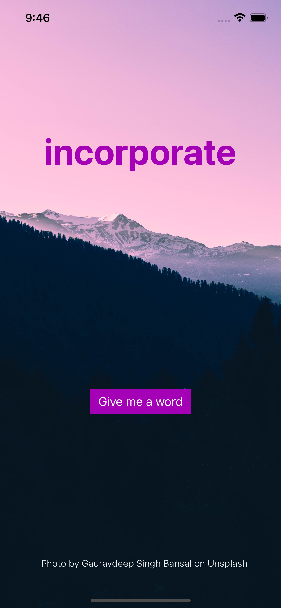

# UIKit Lecture # 18 - Starting point

## What we're building

## App specifications
### Background

- Fill the entire screen
- Content mode: Aspect Fill - read more about content modes here: [https://sarunw.com/posts/how-to-resize-and-position-image-in-uiimageview-using-contentmode/](https://sarunw.com/posts/how-to-resize-and-position-image-in-uiimageview-using-contentmode/)

### Word label

Styling

- Font color: WordColor under Named Colors (#A400B5)
- Font weight: Semibold
- Font size: 50
- Alignment: Center

Constraints

- Center horizontally
- 1/4 of the screen size from the top

### Button

Styling

- Type: Filled button
- Title: Attributed
- Font: Helvetica
- Font weight: Bold
- Font size: 18
- Foreground: CreditsColor under Named Colors (#F0F2F3)

Constraints

- Center horizontally
- 2/3 of the screen size from the top

### Photo credits

Styling

- Font color: CreditsColor under Named Colors (#F0F2F3)
- Font weight: Light
- Font size: 13
- Alignment: Right
- Text: Photo by Gauravdeep Singh Bansal on Unsplash

Constraints

- 30 point right constraint to view
- 20 point bottom constraint to view
